# Text as Data: Computational Analysis of Papal Documents (1215–2016)

**Clay Harris** · jbm2rt@virginia.edu · DS 5001 — Text as Data · Spring 2026

---

## 1. Introduction

This project analyzes a corpus of 553 papal documents (1215–2016) using a reproducible NLP pipeline and unsupervised modeling (TF-IDF, PCA, LDA, Word2Vec).

All quantitative claims below are taken from existing processed outputs in `data/processed/` and regenerated figures in `output/figures/`.

### Research Questions

| # | Question | Method |
|---|----------|--------|
| RQ1 | How does Catholic social-language emphasis change across time? | Topic trends, term dispersion, TF-IDF shift |
| RQ2 | Do modern popes show distinct textual profiles? | LDA profiles, PCA position, sentiment |
| RQ3 | Is Vatican II associated with a measurable distributional change? | PCA period overlays, topic means by era, sentiment by era |

---

## 2. Data Summary

### 2.1 Corpus

| Metric | Value |
|--------|-------|
| Documents | 553 |
| Year range | 1215–2016 |
| Total tokens | 4,224,455 |
| Vocabulary size (`VOCAB.csv`) | 86,053 terms |
| TF-IDF matrix size (`TFIDF_DTM.csv`) | 553 × 29,758 |

Chronological papal/group ordering is based on first observed document year in `LIBRARY.csv`.

### 2.2 Era counts used in analysis

From verified extraction:

- pre-VII (`year < 1962`): 395
- transition (`1962–1965`): 22
- post-VII (`year > 1965`): 96
- unknown year: 40

### 2.3 Language contamination handling (no rerun)

LDA topics show two language-artifact topics:

- `topic_4`: `et, de, la, le, ad, est, ed, qui`
- `topic_5`: `di, che, la, il, per, non, si, del`

Post-hoc rule used in figure generation:

- Mark a document as language-contaminated if `topic_4 + topic_5 > 0.5`
- Result: **70 / 553** documents flagged

This was used to filter the vocabulary-shift plot (Figure 11) without rerunning F1–F4.

---

## 3. Verified Descriptive Results

### 3.1 Sentiment

From `LIBRARY.csv`/`DOC_SENTIMENT.csv` extraction:

- Overall compound sentiment: mean `0.811`, median `1.000`, std `0.515`
- Pre-VII mean: `0.782`
- Transition mean: `0.985`
- Post-VII mean: `0.891`

Modern popes (chronological):

| Pope | n | Compound | Pos | Neg |
|------|---:|---------:|----:|----:|
| Pope St. John XXIII | 12 | 1.000 | 0.208 | 0.049 |
| Pope Paul VI | 35 | 0.920 | 0.177 | 0.049 |
| Pope St. John Paul II | 58 | 0.915 | 0.160 | 0.039 |
| Pope Benedict XVI | 21 | 0.829 | 0.152 | 0.036 |
| Pope Francis | 10 | 0.865 | 0.161 | 0.055 |

### 3.2 LDA topic structure

Top terms by topic (verified):

- `topic_0`: church, life, christ, god, christian, people, cf, faith
- `topic_1`: church, catholic, bishop, see, apostolic, rite, holy, unity
- `topic_2`: god, christ, love, life, man, one, word, church
- `topic_3`: science, research, method, moral, scientific, psychology, principle, personality
- `topic_4`: et, de, la, le, ad, est, ed, qui
- `topic_5`: di, che, la, il, per, non, si, del
- `topic_6`: church, god, may, men, great, christian, catholic, divine
- `topic_7`: human, life, man, good, social, must, one, right
- `topic_8`: council, holy, church, synod, god, say, one, father
- `topic_9`: church, order, may, cardinal, decree, council, make, person

Chronological pope means show:

- Church Councils dominated by `topic_9` (`0.439`)
- Benedict XIV dominated by `topic_5` (`0.672`)
- Pius VI dominated by `topic_5` (`0.921`)
- Clement XIII dominated by `topic_5` (`0.461`)
- Gregory XVI through John XXIII mostly dominated by `topic_6`
- Paul VI dominated by `topic_2` (`0.217`)
- John Paul II dominated by `topic_0` (`0.400`)
- Benedict XVI dominated by `topic_0` (`0.322`)
- Francis dominated by `topic_2` (`0.319`)

### 3.3 Topic means by era

Verified means:

| Era | t0 | t1 | t2 | t3 | t4 | t5 | t6 | t7 | t8 | t9 |
|-----|---:|---:|---:|---:|---:|---:|---:|---:|---:|---:|
| Pre-Modern (<=1890) | 0.004 | 0.087 | 0.048 | 0.000 | 0.030 | 0.278 | 0.389 | 0.013 | 0.022 | 0.130 |
| Social Teaching (1891–1961) | 0.037 | 0.083 | 0.123 | 0.003 | 0.001 | 0.000 | 0.586 | 0.110 | 0.012 | 0.043 |
| Vatican II (1962–65) | 0.289 | 0.109 | 0.206 | 0.000 | 0.013 | 0.000 | 0.133 | 0.127 | 0.015 | 0.107 |
| Post-Vatican II (1966–2000) | 0.349 | 0.074 | 0.231 | 0.001 | 0.016 | 0.000 | 0.054 | 0.182 | 0.005 | 0.087 |
| Contemporary (2001+) | 0.281 | 0.105 | 0.185 | 0.005 | 0.086 | 0.001 | 0.009 | 0.219 | 0.007 | 0.103 |

### 3.4 PCA summary

Explained variance (`explained_variance.csv`):

- PC0: `1.9428%`
- PC1: `0.9367%`
- PC2: `0.8166%`
- PC3: `0.7125%`
- PC4: `0.6571%`
- PC5: `0.6289%`
- PC6: `0.6125%`
- PC7: `0.5790%`
- PC8: `0.5408%`
- PC9: `0.5383%`
- Cumulative PC0–PC9: `7.9651%`

Top/bottom loadings (verified) show PC0 aligned with Italian function words (`che`, `il`, `di`, `non`, `la`) versus common English theological words on the opposite side.

### 3.5 TF-IDF shift around Vatican II

From regenerated run (`/tmp/fig_run.log`) with language-contamination filtering:

- Pre-Vatican II top-15 terms (n=329 docs):
  `automatically, church, god, brethren, venerable, rosary, may, christ, religion, brothers, catholic, session, let, faith, men`
- Post-Vatican II top-15 terms (n=93 docs):
  `theholy, family, council, april, church, july, vatican, married, evangelization, marriage, january, february, mystery, life, october`

Important observation: both lists still include obvious website/tokenization artifacts (`automatically`, `theholy`), so this comparison must be interpreted as noisy rather than clean lexical semantics.

### 3.6 Word2Vec nearest neighbors

Verified examples:

- `labor`: toil, zeal, work, labour, worker, effort
- `justice`: peace, equity, freedom, ultimately, equality, righteousness
- `dignity`: right, freedom, liberty, nature, value, personality
- `poor`: needy, sick, weak, multitude, elderly, suffer
- `faith`: religion, doctrine, truth, belief, unity, teaching
- `social`: economic, political, cultural, politics, global, moral

---

## 4. Research Question Answers (Strictly Data-Based)

### RQ1: Social-language arc over time

Evidence from era topic means shows a shift from high `topic_6` in the 1891–1961 period (`0.586`) toward higher `topic_0`, `topic_2`, and `topic_7` in post-1965 periods (`topic_0=0.349`, `topic_2=0.231`, `topic_7=0.182` in 1966–2000).

However, lexical-shift evidence is partially confounded by scraping/token artifacts, so conclusions about specific word-level change should be conservative.

### RQ2: Distinctiveness of modern popes

Modern popes do show different dominant topic profiles:

- John XXIII: `topic_6` dominant (`0.459`)
- Paul VI: `topic_2` dominant (`0.217`)
- John Paul II: `topic_0` dominant (`0.400`)
- Benedict XVI: `topic_0` dominant (`0.322`)
- Francis: `topic_2` dominant (`0.319`)

Sentiment means also differ across modern popes (range `0.829` to `1.000`).

### RQ3: Vatican II distributional change

The quantitative signal is mixed but measurable:

- Sentiment mean increases from pre-VII `0.782` to post-VII `0.891`
- Topic composition differs between pre-1891 / 1891–1961 and post-1965 eras
- PCA indicates only small per-component explained variance (PC0 <2%), so geometric separation claims should be interpreted cautiously

Overall, evidence supports change across periods, but not a single sharp, high-variance break.

---

## 5. Limitations

1. Language contamination is substantial in early material (70 docs flagged by `topic_4 + topic_5 > 0.5`).
2. Website/token artifacts remain in TF-IDF top-term outputs even after language filtering.
3. PCA captures limited variance in first 10 components (7.97% cumulative), limiting strong spatial interpretations.
4. Some popes have very small sample sizes.

---

## 6. Deliverables

- Figures regenerated with chronological pope ordering and readability updates:
  `output/figures/fig01_docs_per_pope.png` through `output/figures/fig15_modern_pca.png`
- Analysis notebook: `notebooks/03_exploration.ipynb`
- Processed tables retained (no F1–F4 rerun)

---

## 7. Figure References

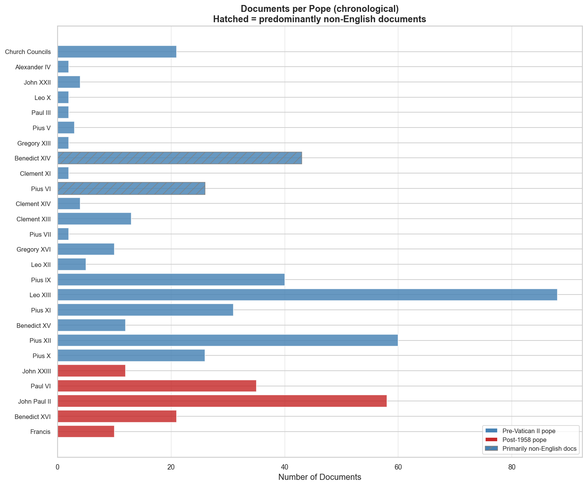

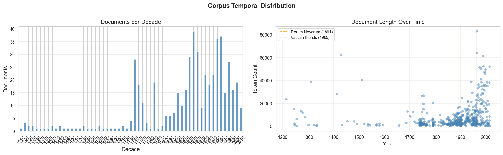

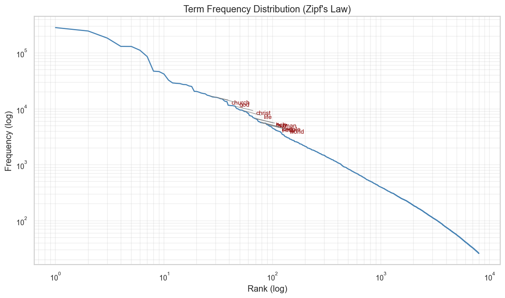

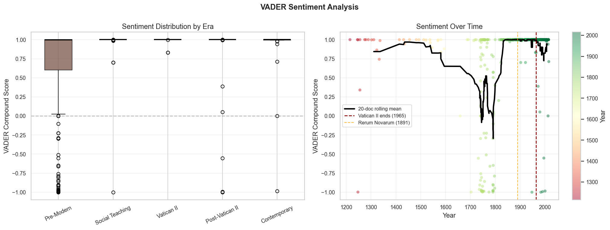

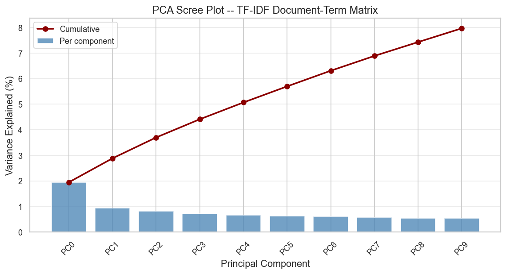

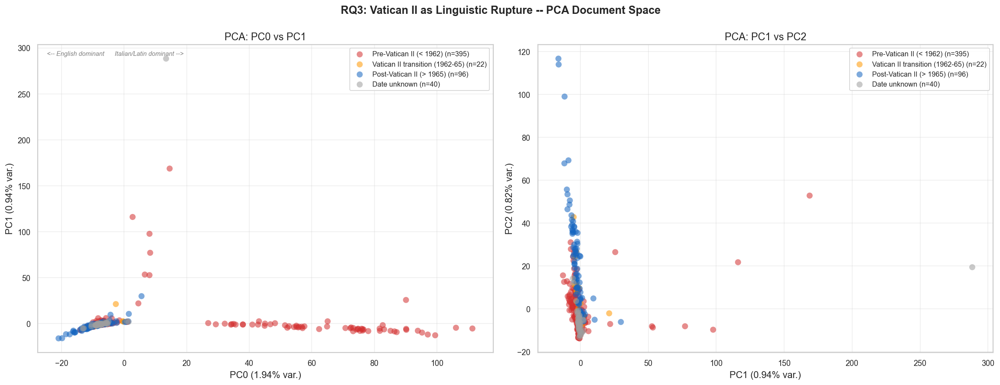

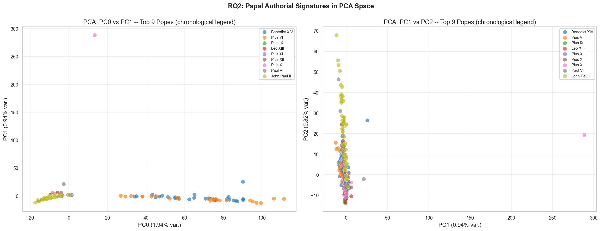

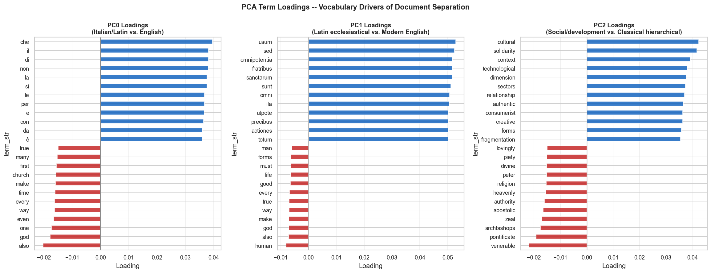

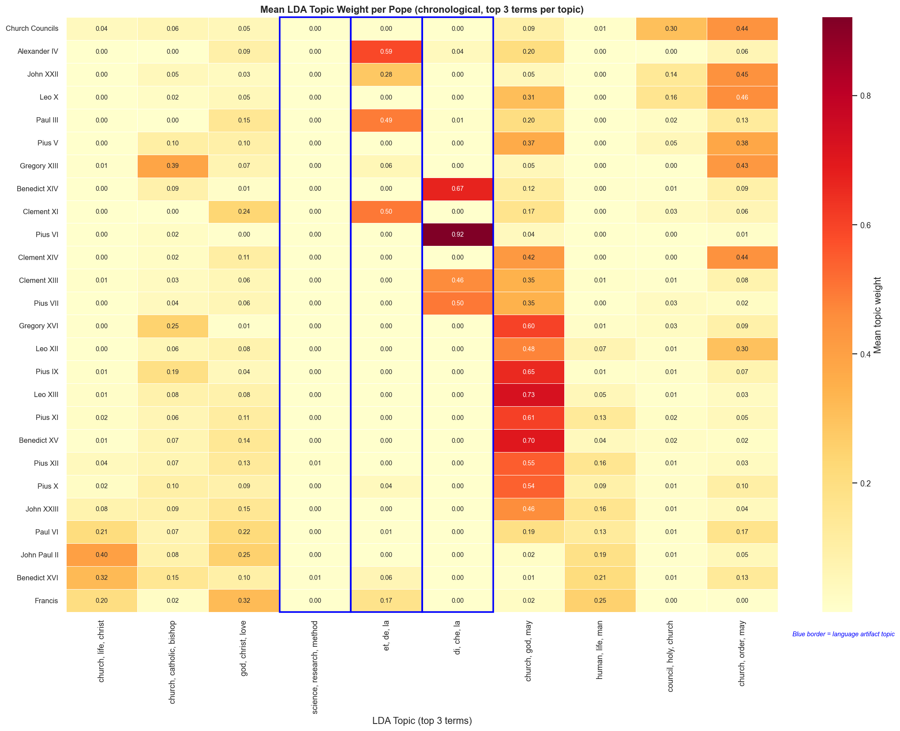

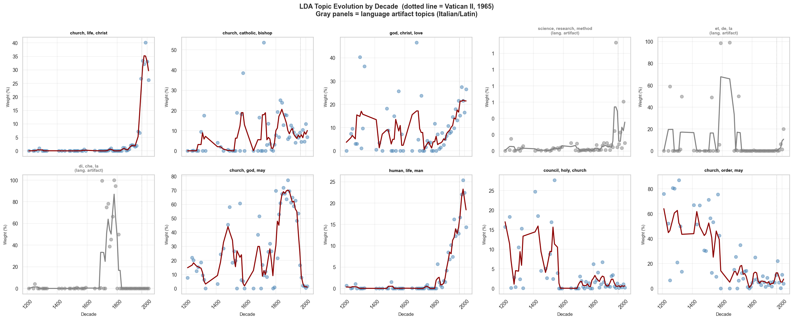

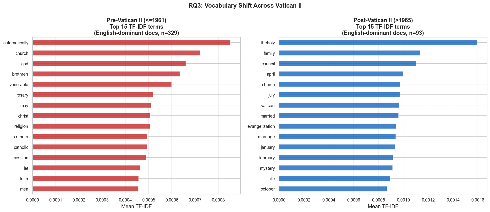

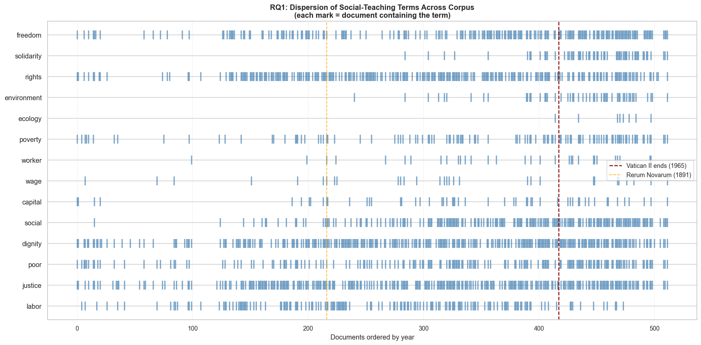

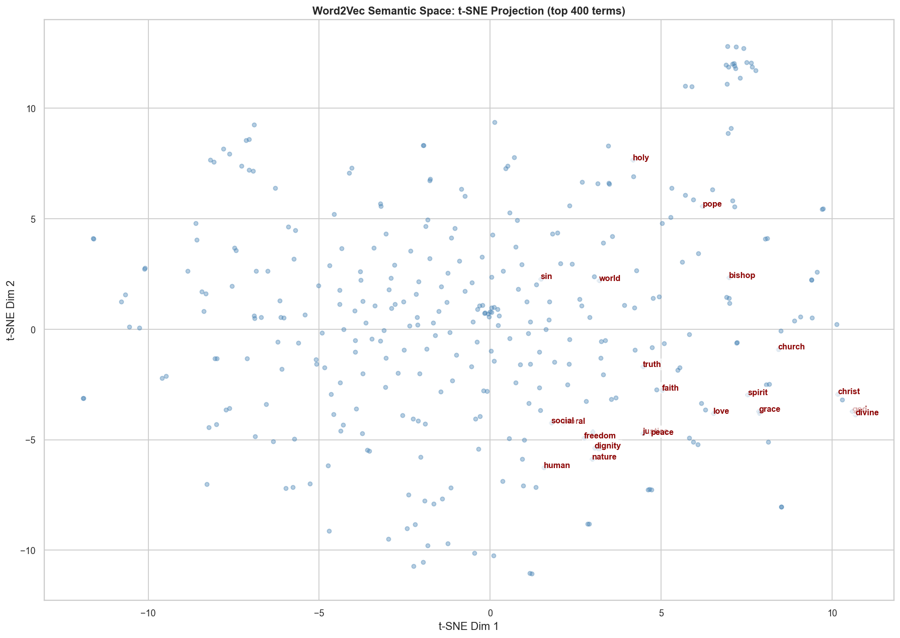

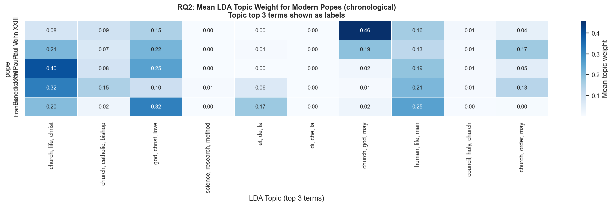

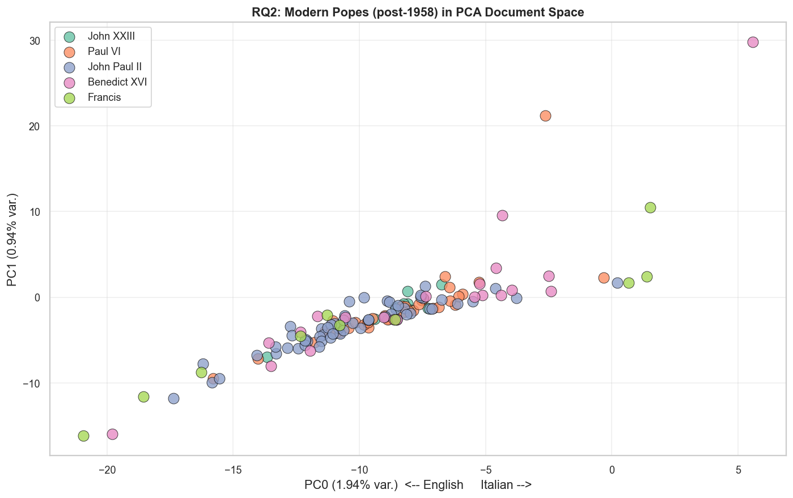
